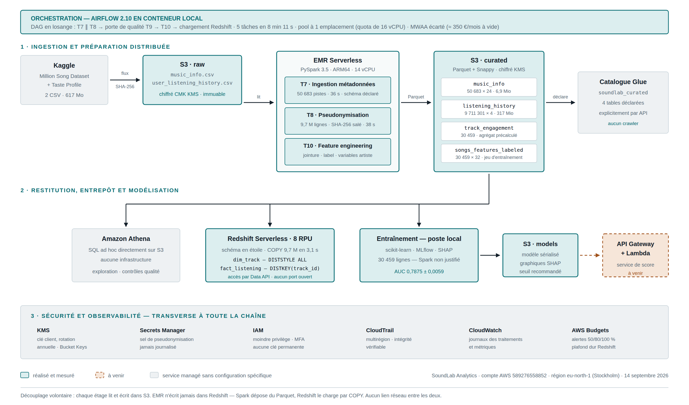

# SoundLab — architecture de données sur AWS

SoundLab Analytics (société fictive) estime, pour des labels indépendants, la probabilité qu'un **titre** atteigne le quartile supérieur des écoutes de son catalogue : le score porte sur un titre, jamais sur une personne, et les écoutes ne servent qu'à des indicateurs agrégés par titre.
Les données sont publiques (Kaggle, ListenBrainz, MusicBrainz) et pseudonymisées avec un sel propre au projet avant tout stockage durable.
L'usage est non commercial, du fait des licences de Kaggle et des étiquettes MusicBrainz.

> Sources : `soundlab-analytics/docs/01_dpia_analyse_impact.md` § 1.1 ; `soundlab-3v/docs/05_journal_trois_v.md`, tâche 0.1.



Version vectorielle : [`docs/architecture.svg`](docs/architecture.svg).

## Contenu du dépôt

| Dossier | Rôle |
|---|---|
| `soundlab-analytics/` | Chaîne v1, livrée et figée : ingestion Kaggle, PySpark sur EMR Serverless, catalogue Glue, entrepôt Redshift Serverless, orchestration Airflow, modèle. Contenu inchangé, seulement filtré. |
| `soundlab-analytics/infra/` | Provisionnement AWS (compartiments S3, KMS, IAM, CloudTrail, Secrets Manager, EMR, Redshift, rétention) et pilote SQL `rs.sh`. |
| `soundlab-analytics/jobs/`, `ml/` | Jobs PySpark (ingestion, pseudonymisation, qualité, variables) et entraînement ou évaluation du modèle. |
| `soundlab-analytics/orchestration/` | Installation d'Airflow, rôle et jetons temporaires, droits Redshift, surveillance ; `dags/` contient les DAG et leur SQL. |
| `soundlab-analytics/sql/` | Schéma en étoile, benchmarks, montée en charge. |
| `soundlab-analytics/docs/` | Journal technique, AIPD, benchmarks Redshift, rapport de modélisation. |
| `soundlab-3v/` | Chantier « trois V » : ListenBrainz et MusicBrainz, chargement quotidien, entrepôt `soundlab_lb`, alarmes. Contenu inchangé, seulement filtré. |
| `soundlab-3v/ingestion/`, `lambda/` | Ingestion en flux avec pseudonymisation en chemin ; fonctions Lambda d'ingestion, de pilotage et de sonde. |
| `soundlab-3v/infra/` | Droits IAM, machine Step Functions, planification EventBridge, catalogue Glue, alarmes CloudWatch, tests. |
| `soundlab-3v/jobs/`, `sql/`, `ml/` | Aplatissement, agrégation, qualité, entrepôt `soundlab_lb` et réentraînement. |
| `soundlab-3v/docs/` | Journal du chantier trois V et avenant à l'AIPD. |
| `docs/` | Diagramme d'infrastructure. |

Les deux dossiers doivent rester **frères, sous ces noms** : les commandes du chantier trois V appellent le pilote v1 par un chemin relatif (`../soundlab-analytics/infra/rs.sh`, cité dans les en-têtes de `soundlab-3v/sql/*.sql`).

`soundlab-analytics/infra/07_ingest_music_info.py` est une version conservée dans la v1 figée. Elle est distincte de `soundlab-analytics/jobs/07_ingest_music_info.py`, qui est le job soumis à EMR.

Écarté volontairement : données, journaux, modèles sérialisés, archives, rapport et diaporama du Bloc 6, fichiers `.env`.

## Déploiement

Prérequis : AWS CLI v2 et Python 3. L'authentification passe par `aws login` (OAuth 2.0 avec PKCE), avec des identifiants **temporaires** : aucune clé d'accès longue durée n'est stockée sur le poste (`soundlab-analytics/docs/00_journal_technique.md` § 3).

1. Créer le fichier d'environnement à partir de l'exemple, qui ne contient que des noms de variables, puis le compléter :
   ```bash
   cp soundlab-analytics/.soundlab.env.exemple soundlab-analytics/.soundlab.env
   ln -s ../soundlab-analytics/.soundlab.env soundlab-3v/.soundlab.env   # les scripts 3V le lisent à leur racine
   ```
   `.soundlab.env` est ignoré par Git. Il ne contient que des identifiants de ressources (ARN, noms), jamais le sel de pseudonymisation, qui réside dans Secrets Manager.
2. Socle v1, dans l'ordre des numéros : `bash infra/01_bootstrap.sh`, puis `02_datasets_et_emr.sh`, `03_retention.sh`, `04_redshift.sh` et `07_droits_unload.sh`, depuis `soundlab-analytics/`. `01_bootstrap.sh` est **idempotent** et refuse de démarrer si la région effective diffère de `eu-north-1` (journal technique § 4). `03_retention.sh`, `07_droits_unload.sh` et les scripts `orchestration/00`, `01`, `02`, `05` et `06` se déclarent eux aussi idempotents dans leur code.
3. Jobs PySpark : `bash infra/submit_job.sh <job>` soumet un job à EMR Serverless.
4. Orchestration : `orchestration/00_init_airflow.sh` à `06_surveillance.sh`. `02_jetons.sh` remet à Airflow des identifiants temporaires issus d'un rôle restreint, jamais la clé permanente.
   Airflow tourne en Docker local ; `docker-compose.exemple.yaml` est le fichier de déploiement, avec les mots de passe remplacés par des variables à définir. Ces variables sont `AIRFLOW_DB_PASSWORD` (base PostgreSQL d'Airflow) et `AIRFLOW_ADMIN_PASSWORD` (compte administrateur de l'interface). Elles se définissent dans `orchestration/.env`, ignoré par Git. Copier l'exemple en `docker-compose.yaml` avant `docker compose up`.
5. Chantier trois V, depuis `soundlab-3v/` : droits (`infra/3v_03`, `3v_12`), machine de chargement (`3v_13_machine_chargement.json`, `3v_14_deployer_machine.zsh`), planification quotidienne (`3v_15_planifier_chargement.zsh`), catalogue (`3v_76_catalogue_lb.sh`), alarmes (`3v_80_alarmes.sh`), entrepôt (`sql/3v_70_entrepot_lb.sql` via `../soundlab-analytics/infra/rs.sh`).

## RGPD et sécurité

- **Pseudonymisation avant tout stockage durable.** v1 : `user_id_hash = SHA-256(sel || user_id)`, tronqué à 128 bits, avec un contrôle anti-collision bloquant (journal technique § 7.2). Trois V : jeton HMAC-SHA-256 salé, tronqué à 128 bits, calculé en chemin, flux en mémoire, `user_name` supprimé, avec un sel distinct de celui de la v1 (`06_aipd_avenant_trois_v.md` § 3).
- **Agrégation dès la zone affinée** (trois V) : aucune ligne individuelle n'y arrive, seulement des agrégats par titre et par jour et une esquisse HyperLogLog des auditeurs (avenant AIPD § 3).
- **Chiffrement** : clé KMS gérée par le client `alias/soundlab` avec rotation annuelle, SSE-KMS sur les compartiments de données, refus de tout appel HTTP en clair (AIPD § 4.1).
- **Moindre privilège** : rôles bornés à des compartiments, à la seule clé KMS et au seul secret du projet ; aucun `s3:*` sur `*` (journal technique § 4.3, AIPD § 4.3). Les rôles trois V sont simulés chemin par chemin, avec des cas refusés (`05_journal_trois_v.md`, tâches 3.1 et 3.3).
- **Secrets** : le sel est dans Secrets Manager, chiffré par la clé du projet et jamais écrit sur disque ; le job s'arrête si le secret est inaccessible (AIPD § 4.2).
- **Traçabilité** : CloudTrail multirégion avec validation d'intégrité (AIPD § 4.4).
- **Rétention** : 30 jours pour la zone brute ListenBrainz (`05_journal_trois_v.md`, tâche 0.4).
- **Aucune donnée dans ce dépôt**, ni fichier `.env`, ni clé. Le dépôt a été contrôlé avec `gitleaks` avant publication.
- Analyses d'impact complètes : `soundlab-analytics/docs/01_dpia_analyse_impact.md` et `soundlab-3v/docs/06_aipd_avenant_trois_v.md`.

## Correspondance avec les critères du jury (Bloc 2)

| Critère | Où le vérifier |
|---|---|
| Pertinence de l'architecture | `docs/architecture.png` ; `soundlab-analytics/docs/00_journal_technique.md` § 2 et § 2.1 (arbitrages : EMR Serverless, Redshift Serverless, Parquet + Snappy, région) ; `docs/02_benchmarks_redshift.md` |
| Robustesse — **Volume** | `soundlab-3v/docs/05_journal_trois_v.md`, phase 1 : 695 656 837 écoutes ingérées (§ 1.2), montée en charge par paliers (§ 1.3), dimensionnement dérivé du volume dans `jobs/3v_23_agregation_mois.py` (§ 1.4) ; `soundlab-analytics/sql/montee_en_charge/` |
| Robustesse — **Variété** | Aplatissement du JSON (`jobs/3v_24_aplatissement.py`), contrat de schéma (`config/3v_contrat_listenbrainz_v1.json`), source relationnelle MusicBrainz (`ingestion/3v_15`, `jobs/3v_26` à `3v_29`), porte de qualité (`jobs/3v_30_porte_qualite_3v.py`) — journal trois V, tâches 2.1 à 2.5 |
| Robustesse — **Vélocité** | Chargement incrémental idempotent (`infra/3v_09_charger_incremental.py`, tâche 3.1), données en retard (tâche 3.2), chargement quotidien par EventBridge, Step Functions et Lambda (`infra/3v_13` à `3v_15`, `lambda/`, tâche 3.3), fraîcheur et alarmes (`infra/3v_17`, `3v_80_alarmes.sh`, tâche 5.1) |
| RGPD et sécurité | Section précédente ; `infra/01_bootstrap.sh` (KMS, IAM, CloudTrail, Secrets Manager) ; `infra/03_retention.sh` ; AIPD et avenant |
| Qualité du code et de la documentation | Scripts idempotents (voir « Déploiement ») ; tests (`soundlab-analytics/jobs/09_tests_qualite.py`, `soundlab-3v/infra/3v_11_test_pilotage.py`, `3v_16_test_type_modifie.py`, `3v_20` à `3v_28`) ; journaux techniques datés avec les incidents (`00_journal_technique.md` § 10, `05_journal_trois_v.md`) |

## Licences des sources

| Source | Licence |
|---|---|
| Kaggle `undefinenull/million-song-dataset-spotify-lastfm` | CC BY-NC 4.0 |
| ListenBrainz, écoutes | CC0 1.0 |
| MusicBrainz, données principales | CC0 |
| MusicBrainz, étiquettes, genres, notes | CC BY-NC-SA 3.0 |

Source : `soundlab-3v/docs/05_journal_trois_v.md`, tâche 0.1, « Licences retenues ». Le projet reste en régime non commercial.
